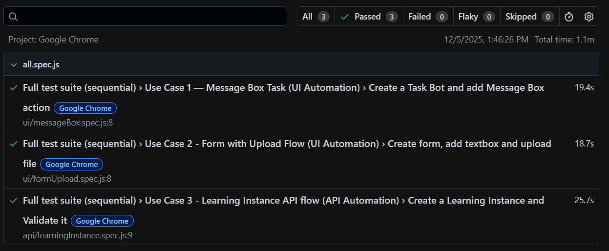

# Automation Anywhere – UI & API Automation Assignment (Playwright)

This repository contains automation for **three use cases** involving UI and API flows using **Playwright**.  
The entire assignment was implemented following the Page Object Model (POM) structure and meets all requirements provided in the official assignment document.  

---

# 📘 Assignment Description 
- Framework: Playwright  
- Follow the Page Object Model (POM) design pattern for UI automation.  
- Ensure assertions for:  
  • UI element visibility and interaction  
  • Functional flow and expected behaviors  
  • API response validations and correctness  

Application used for automation:  
https://www.automationanywhere.com/products/enterprise/community-edition  

---

# ✅ Use Case 1: Message Box Task (UI Automation)

### **Steps Automated**
1. Log in to the application.  
2. Navigate to Automation from the left-hand menu.  
3. Click Create → Task Bot.  
4. Fill all required fields and click Create.  
5. In the Actions panel, search for **Message Box** and add it.  
6. Validate UI elements and interactions on the right-side properties panel.  
7. Save the configuration.

### **Assertions Performed**
- UI visibility  
- Correct data entry  
- Successful creation  
- Confirmation messages  
- Full functional validation  

---

# ✅ Use Case 2: Form with Upload Flow (UI Automation)

### **Steps Automated**
1. Log in.  
2. Navigate to Automation.  
3. Create a new **Form**.  
4. Drag & drop **Textbox** and **Select File** from the left panel.  
5. Validate all UI properties on the right panel.  
6. Enter text in Textbox.  
7. Upload a document from local/shared folder.  
8. Save and verify file upload.

### **Assertions Performed**
- Drag & drop functional behavior  
- Textbox input  
- File upload success  
- All UI interactions in the properties panel  
- Form save success  

---

# ✅ Use Case 3: Learning Instance API Flow (API Automation)

### **Steps Automated**
1. Login using API credentials.  
2. Navigate to Learning Instance section (API call).  
3. Create a new Learning Instance using POST request.  
4. Validate the created instance using GET request.  

### **API Validations Performed**
- HTTP Status Code  
- Response Time  
- Existence of created instance in API response  
- Field-level schema checks (ID, name, provider info, timestamps, etc.)  

---

# 🧪 Test Execution Screenshot  
(All 3 tests running sequentially)



---

# 📝 Sanitized API Response (Use Case 3)

```
{
  "status": 200,
  "timeMs": 6498,
  "instance": {
    "id": "SAMPLE-ID-0001",
    "name": "auto-instance-1764922643156",
    "description": "",
    "providerId": "PROVIDER-ID-0001",
    "providerName": "Automation Anywhere (Pre-trained)",
    "processStatus": "PRIVATE",
    "metricsUploadCount": 0,
    "metricsValidationCount": 0,
    "providerConfig": {
      "maxFileSizeName": "50MB",
      "maxFileSizeBytes": 52428800,
      "maxPages": 100,
      "maxPagesAsync": 100,
      "fileTypes": [Array],
      "note": "true"
    },
    "learningInstanceProcesses": {
      "processes": [Array]
    },
    "createdBy": 0,
    "createdOn": "2025-01-01T00:00:00Z",
    "updatedBy": 0,
    "updatedOn": "2025-01-01T00:00:00Z",
    "isExternal": false,
    "domainId": "DOMAIN-ID-0001",
    "domainName": "Invoices",
    "classicLearningInstanceId": "",
    "isHeuristicFeedbackEnabled": true,
    "locale": "en-US",
    "parserId": "",
    "parserName": "",
    "useGenai": false,
    "genaiProvider": "NA",
    "isTestModeEnabled": false,
    "isCloudExtraction": false
  },
  "fullResponse": {
    "page": { "offset": 0, "total": 5, "totalFilter": 5 },
    "list": [ [Object], [Object], [Object], [Object], [Object] ]
  }
}
```

---

# 🧱 Project Structure

```

/assets
   test-results.png

/helpers
   apiValidator.js

/pages
   aiPage.js
   automationPage.js
   formPage.js
   learningInstancePage.js
   loginPage.js
   messageBoxPage.js

/test_data
   testFile.pdf

/tests
   /ui
      messageBox.spec.js
      formUpload.spec.js
   /api
      learningInstance.spec.js
   all.spec.js
   loginTest.spec.js

.env
.gitignore
package-lock.json
package.json
playwright.config.js
README.md

```

---
## Prerequisites
- Node.js installed
- npm

## Setup
1. Clone/download the repo.
2. Copy `.env.example` to `.env` and fill values:


---

# ▶️ How to Run the Tests

## Install dependencies
`npm install`

## Install browsers
`npm run install-browsers`

## Run full suite in sequence
`npm run test -- ./tests/all.spec.js`

## View report
`npm run test:report`

---

# 🛠 Tools & Frameworks Used

- Playwright Automation Framework  
- JavaScript  
- Page Object Model (POM)  
- API Testing with Playwright request context  

---

# 📌 Notes

- Sensitive API response data has been sanitized.  
- Report artifacts are intentionally excluded from the repository.  

---

## Contact

Made by [Sangeeta Mittal](https://github.com/sangeetamittal)

